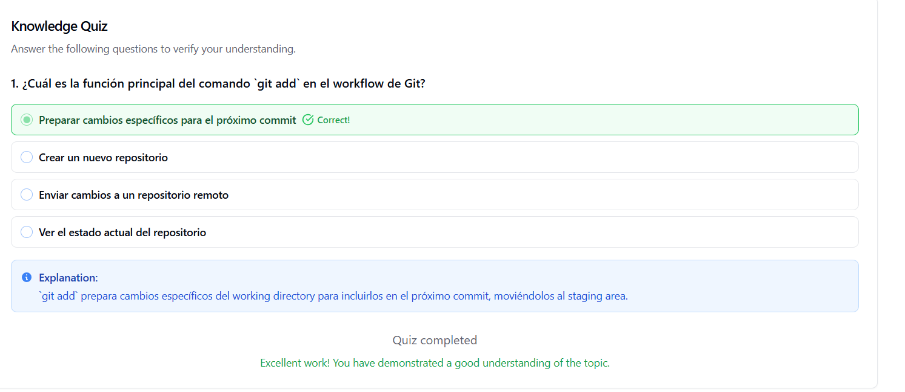

# **Ejercicio**: Configura Git y crea tu primer repositorio local
| Autor            | Fecha        | Día |
|------------------|--------------|----------|
| **Carlos Vásquez** |04 Noviembre 2025 | 2 |
## Ejercicio práctico para aplicar los conceptos aprendidos.

### Instalación

```sh
En macOS: brew install git
En Ubuntu/Debian: sudo apt install git
Verifica: git --version
```

### Configuración Inicial

```sh
git config --global user.name "Tu Nombre Completo"
git config --global user.email "tu.email@ejemplo.com"
git config --global core.editor "code --wait"  # Para VS Code
git config --global init.defaultBranch main

```

### Verificación de configuración:

```sh
git config --list --show-origin

```
### Crear primer repositorio:

```sh
mkdir mi-primer-repo
cd mi-primer-repo
git init
echo "# Mi primer repositorio" > README.md
git status
git add README.md
git status
git commit -m "Initial commit: Agregar README básico"
git log --oneline
```

### Quiz Comandos Básicos



